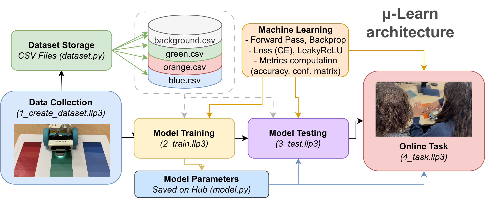

# μ-Learn: A Lightweight, On-Device Machine Learning Library for Educational Robotics Platforms


**μ-Learn** is a lightweight machine learning library designed specifically for educational robotics platforms.
It enables students and hobbyists to implement machine learning algorithms directly on their robots, fostering hands-on learning and experimentation in the field of artificial intelligence.

## Features
- **Lightweight and Efficient**: Optimized for low-resource environments typical of educational robotics platforms (it'swritten in MicroPython!).
- **Easy to Use**: Simple API designed for beginners and educators.
- **Fully on-Device**: No need for external servers or cloud services; all computations are performed on the robot itself, including data collection, training (yes, also backpropagation), and inference.
- **Educational Focus**: Includes tutorials and examples tailored for educational purposes.

## Supported Algorithms
- Multi-Layer Perceptron (MLP) Neural Networks


## Getting Started

### Installation
No libraries need to be installed! Just copy the `ulearn` folder into your MicroPython environment. To this end, use the script 'upload2hub.py' provided in the repository.

### Example Usage
Here's a simple example of how to create and train a Multi-Layer Perceptron (MLP) using μ-Learn:

```python
from model import SimpleNN

model = SimpleNN(input_size=INPUT_SIZE, num_classes=NUM_CLASSES)
# Train the model with your data

for epoch in range(EPOCHS_NUM):
    for i in range(len(X_train)):
        model.forward(X_train[i])
        model.backward(y_train[i], learning_rate)
    
    # Evaluate training accuracy and loss
    train_acc, train_loss = accuracy_and_loss(model, X_train, y_train)

```

## Learning Activity: Color Recognition
An example learning activity using μ-Learn is provided in the `learning_activity` folder.

This activity guides students through the process of building a simple robot that can learn to navigate its environment using a neural network.

We propose a learning activity concerning the color recognition problem: the robot must learn to recognize different colors and take appropriate actions based on the recognized color.

It is divided into four main tasks, in folder `learning_activity` you can find all the necessary code and instructions to carry out each task. Just import them into the Lego Spike App or the WebApp and follow the instructions! 



### task n.1: Data Collection
The robot collects sensor data and corresponding actions taken by a human operator to create a training dataset.

### task n.2: Model Training
Using the collected data, the robot trains a Multi-Layer Perceptron (MLP) model on-device to learn the mapping between sensor inputs and actions.

### task n.3: Model Testing
After training, the model is tested on the test set to evaluate its performance.

### task n.4: Online Task
Finally, the robot uses the trained model to navigate its environment autonomously, making decisions based on real-time sensor inputs.